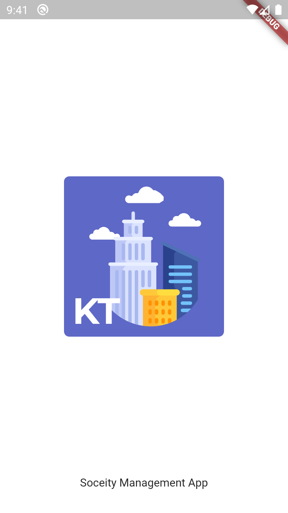
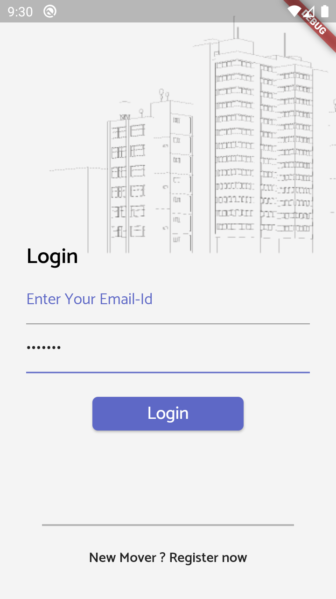
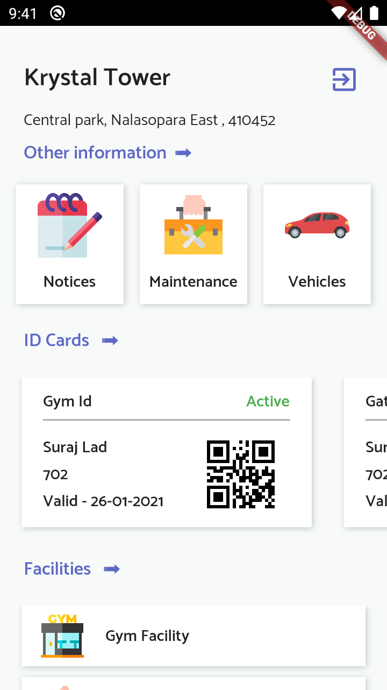
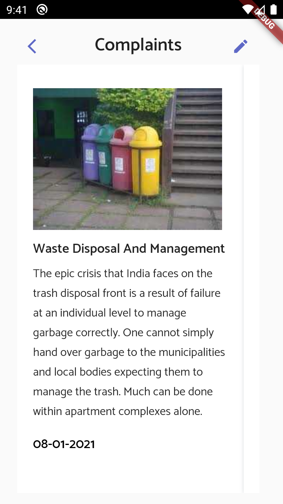

# Housing_Society_App

Housing Society App UI with Firebase Backend 
 
#### Supported features:
- Interactive UI
- Registeration / Login using Firebase Auth
- Firebase Realtime Database 
- Complaints section.
- State management using GetX

Test App by Downloading Apk From Screenshot/app.apk

#### Getting Started:

1. Clone The Repo 
2. run ```flutter run ```

#### Screenshots:

 <br>
 

#### Graphics Credits:
- FlatIcons
- FreePik
